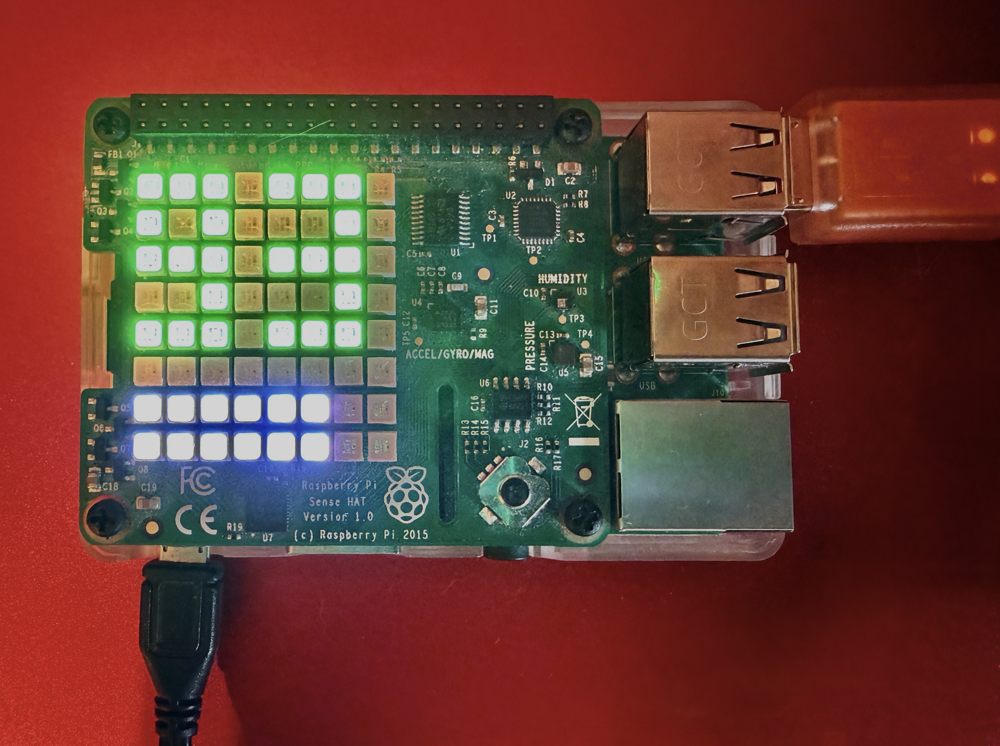
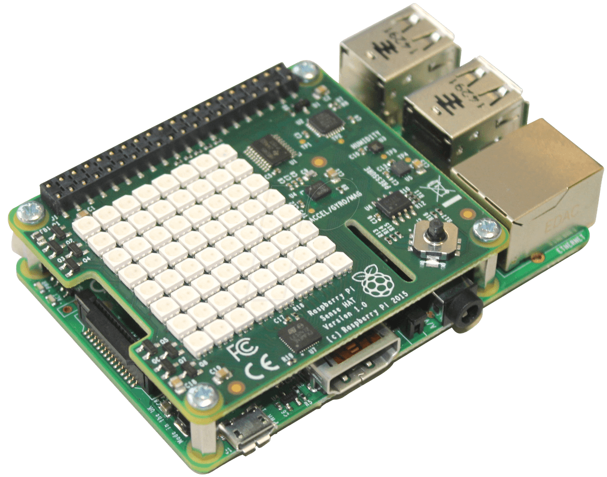
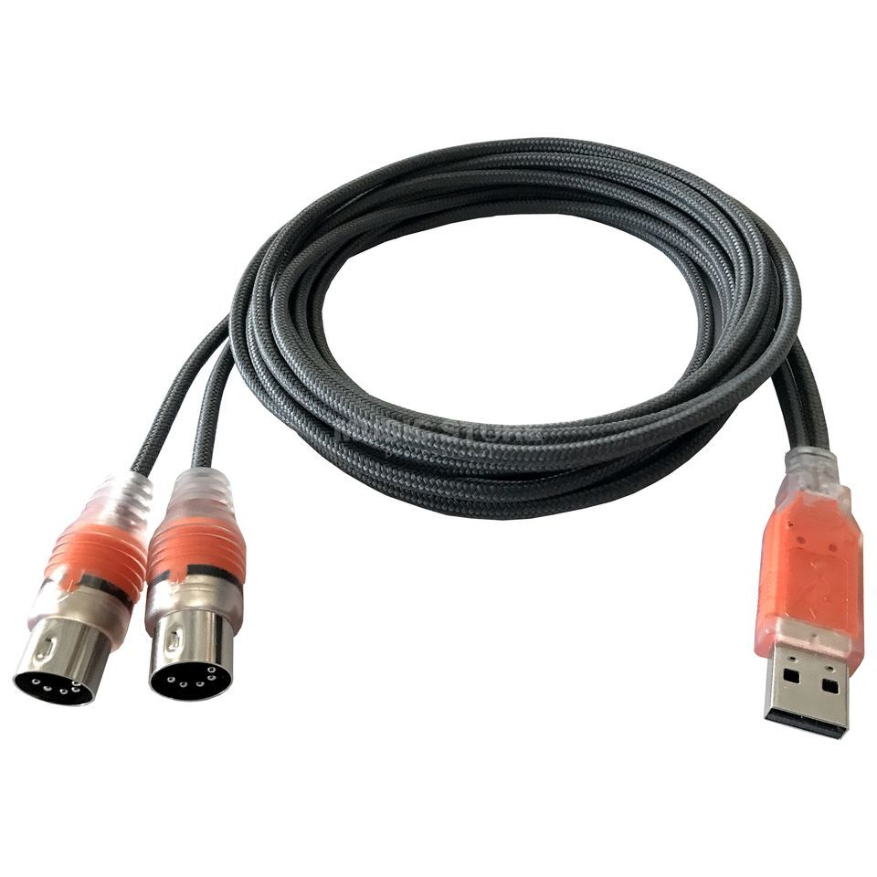

# Raspberry Pi MIDI Clock Master

A MIDI clock master application for Raspberry Pi 3 Model B with Sense HAT and USB MIDI interface. Optimized to auto-detect and open all ports on the ESI MidiMate eX, but works with any class-compliant USB MIDI device.

<p align="center">
  
</p>

<p align="center">
  
  
</p>

## Features

- Sends MIDI clock signals (24 pulses per quarter note) through USB MIDI interface
- Displays current BPM on Sense HAT LED matrix
- Joystick control:
  - **Up**: Increase BPM by 1 (repeats while held)
  - **Down**: Decrease BPM by 1 (repeats while held)
  - **Left**: Fine decrease BPM by 0.1 (single step)
  - **Right**: Fine increase BPM by 0.1 (single step)
  - **Press (Middle)**: Start/Stop MIDI clock
- Accurate timing for MIDI clock messages
- Visual feedback: Green display when running, red when stopped

## Hardware Requirements

- Raspberry Pi 3 Model B (or compatible)
- Sense HAT
- USB MIDI interface (any class-compliant USB MIDI device; ESI MidiMate eX is auto-detected and both of its ports are opened when present)


## Software Requirements

- Raspberry Pi OS
- Python 3.6 or higher

## Installation

1. Install system dependencies:
```bash
sudo apt-get update
sudo apt-get install -y python3-pip python3-dev python3-venv
```

2. Install Sense HAT system packages (required for hardware access):
```bash
sudo apt-get install -y sense-hat python3-sense-hat
```

3. Create a virtual environment with system site-packages access:
```bash
python3 -m venv --system-site-packages venv
```

4. Activate the virtual environment and install Python packages:
```bash
source venv/bin/activate
pip install -r requirements.txt
```

5. Ensure your MIDI interface is connected and recognized:
```bash
# Check if MIDI device is detected
aconnect -l
```

6. **Optional: Set up systemd service for auto-start at boot:**
   
   The project includes a systemd service file that can be set up to automatically start the MIDI clock at boot. The service file should be located at `/etc/systemd/system/midi-clock.service` and uses the `run-on-console.sh` script.

## Usage

### Quick Start (Recommended)

Use the provided helper script:
```bash
cd ~/RaspberryPiMidiClock
./start_midi_clock.sh
```

### Manual Start

Activate the virtual environment and run the application:
```bash
cd ~/RaspberryPiMidiClock
source venv/bin/activate
python3 midi_clock.py
```

### Stop the Application

Use the stop script:
```bash
./stop_midi_clock.sh
```

Or if running as a systemd service:
```bash
sudo systemctl stop midi-clock.service
```

Or manually with `Ctrl+C` if running in foreground, or `pkill -f midi_clock.py` if running in background.

The application will:
- Automatically detect and open MIDI ports (prefers ESI MIDIMATE eX and opens all its ports if present; otherwise uses the first non-"Midi Through" port, or the first available port as a fallback)
- Send MIDI clock to all open ports simultaneously
- Display the current BPM on the Sense HAT LED matrix
- Respond to joystick input for BPM control and start/stop

**Note:** The application works with any USB MIDI interface. It will automatically detect ESI MIDIMATE eX if connected, but will fall back to any other available MIDI device.

### Controls

- **Joystick Up**: Increase BPM (+1)
- **Joystick Down**: Decrease BPM (-1)
- **Joystick Left**: Fine decrease BPM (-0.1)
- **Joystick Right**: Fine increase BPM (+0.1)
- **Joystick Press**: Toggle start/stop MIDI clock

### BPM Range

The BPM is clamped between 20 and 300 BPM for safety.

## MIDI Clock Specification

The application sends standard MIDI clock messages:
- **MIDI Clock (0xF8)**: Sent 24 times per quarter note at the specified BPM
- **MIDI Start (0xFA)**: Sent when clock is started
- **MIDI Stop (0xFC)**: Sent when clock is stopped

## Troubleshooting

### No MIDI ports available

If you see "No MIDI output ports available":
1. Check that your USB MIDI interface is connected
2. Verify the device is recognized: `lsusb`
3. Check ALSA MIDI ports: `aconnect -l`
4. You may need to install ALSA MIDI support: `sudo apt-get install alsa-utils`

### Sense HAT not detected

If the Sense HAT is not working:
1. Ensure it's properly connected to the GPIO header
2. Check I2C is enabled: `sudo raspi-config` → Interface Options → I2C → Enable
3. Verify I2C connection: `sudo i2cdetect -y 1`

### Joystick interfering with OS

If the joystick is controlling the Raspberry Pi OS (cursor movement, etc.) instead of just the MIDI clock application:

You can disable OS joystick handling by blacklisting the joystick kernel module. Create a blacklist file:
```bash
echo "blacklist rpisense-js" | sudo tee /etc/modprobe.d/blacklist-rpisense-js.conf
sudo modprobe -r rpisense-js
sudo reboot
```

The Sense HAT Python library can still access the joystick directly through I2C even when the OS kernel module is disabled.

To re-enable OS joystick handling later:
```bash
sudo rm /etc/modprobe.d/blacklist-rpisense-js.conf
sudo reboot
```

### Permission issues

If you encounter permission errors:
1. Add your user to the `i2c` group: `sudo usermod -a -G i2c $USER`
2. Log out and log back in for changes to take effect

### Service not starting at boot

If the systemd service is not starting at boot:
1. Check service status: `sudo systemctl status midi-clock.service`
2. Check service logs: `journalctl -u midi-clock.service -n 50`
3. Ensure the service is enabled: `sudo systemctl enable midi-clock.service`
4. Verify the `run-on-console.sh` script exists and is executable

## License

This project is provided as-is for educational and personal use.

